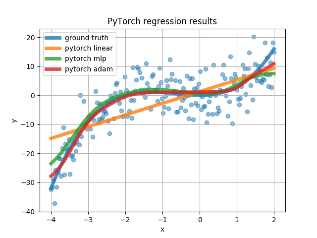

# PyRegression

This is a short regression tutorial that is meant to show the differences of implementing a linear regression and a 2-layer neural network regressor in [Theano](http://www.deeplearning.net/software/theano/) and [PyTorch](pytorch.org). To start off it also uses their implementation in [Scikit-Learn](http://scikit-learn.org/stable/index.html). 

The whole code is in a single py file which is segmented into cells using Spyder specifications, i.e. to get the most out of it - it is meant to be run cell by cell in Spyder.

The code is based on various other regression tutorials including:

1. ["Linear Regression Example" by Jaques Grobler](http://scikit-learn.org/stable/auto_examples/linear_model/plot_ols.html#sphx-glr-auto-examples-linear-model-plot-ols-py)

2. ["A Real Example: Logistic Regression" in Theano Tutorial](http://deeplearning.net/software/theano/tutorial/examples.html)

3. ["Learning PyTorch with Examples" by Justin Johnson] (http://pytorch.org/tutorials/beginner/pytorch_with_examples.html)

4. [PyTorch-Tutorial : 301_regression by Morvan Zhou](https://github.com/MorvanZhou/PyTorch-Tutorial/blob/master/tutorial-contents/301_regression.py) -  cool plotting take from here
 

The code is divided in four main sections:

1. Scikit-learn
2. Theano
3. PyTorch
4. PyTorch - full bells and whistles
5. Bonus: PyTorch for GPU matrix computations

Here are the plots obtained for PyTorch:

